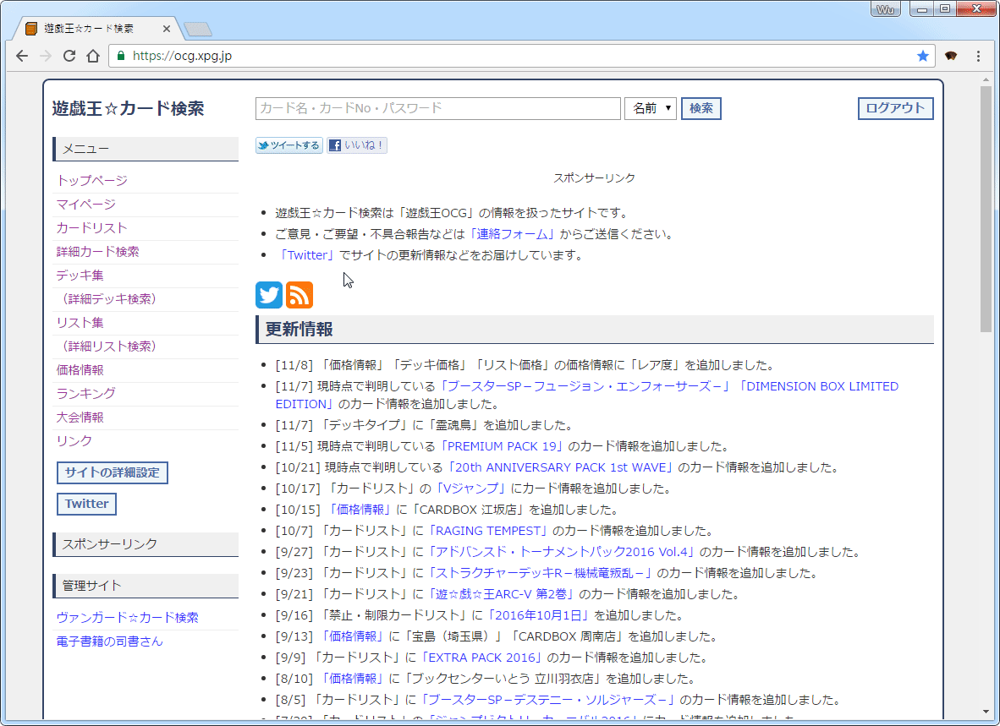

# Yu-Gi-Oh Deck Downloader

Download Yu-Gi-Oh Decks from [ocg.xpg.jp](https://ocg.xpg.jp/deck/deck.fcgi) for Automatic Dueling System(遊戯王ADS) like YGOPro or DevPro.

## Example

## Usage

1. Download newest [package extension file(.crx)](https://github.com/Jasonnor/Yu-Gi-Oh-Deck-Downloader/releases)
2. Open chrome://extensions/ and drag .crx file onto that page.
3. Go to [ocg.xpg.jp](https://ocg.xpg.jp/deck/deck.fcgi) and enter the desired deck.
4. Press the extension button in the upper-left corner, or right-click on page then select "Download Deck".
5. Move the downloaded file to "[Your ADS directory]/deck/"

You will then be able to see the deck you just downloaded in the ADS deck edit screen.

## Reference

+ [eligrey](https://github.com/eligrey) - [FileSaver.js](https://github.com/eligrey/FileSaver.js)

## Contributing

Please feel free to use it if you are interested in fixing issues and contributing directly to the code base.

## License

Yu-Gi-Oh Deck Downloader is released under the MIT license. See the [LICENSE](/LICENSE) file for details.
